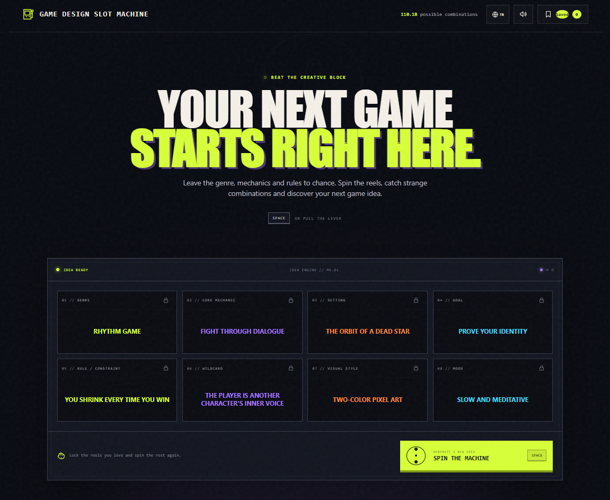
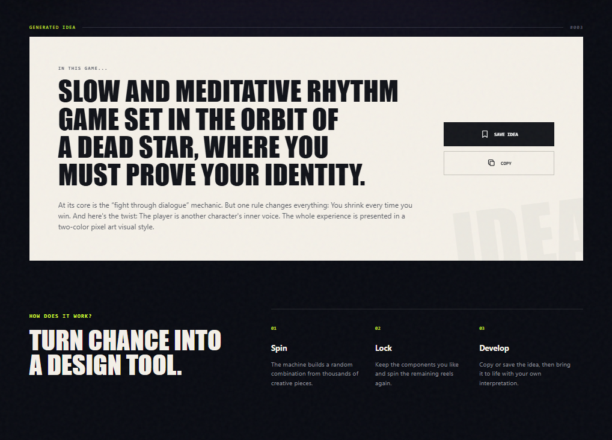

# 🎰 Game Design Slot Machine

> **Fikirhane** in Turkish — an AI-assisted creative tool for game designers, developers, students, and anyone looking for an unusual starting point for their next game.

Game Design Slot Machine combines eight design dimensions to generate more than **110 billion possible game concepts**. Spin all the reels for a completely new idea, or lock the parts you like and keep exploring.



## What does it generate?

Every spin combines:

| Reel | What it defines | Example |
| --- | --- | --- |
| Genre | The overall game format | Rhythm game |
| Core mechanic | The player's central action | Fight through dialogue |
| Setting | Where the game takes place | The orbit of a dead star |
| Goal | What the player must achieve | Prove your identity |
| Rule / constraint | A restriction that shapes the design | You shrink every time you win |
| Wildcard | An unexpected narrative or systemic twist | The player is another character's inner voice |
| Visual style | The game's visual direction | Two-color pixel art |
| Mood | The intended emotional tone | Slow and meditative |

The result is turned into a readable game pitch that can be copied, saved, or developed further.



## AI-assisted, with privacy built in

This is an **AI-assisted game ideation application**. Its large bilingual idea library and creative combinations were designed and curated with AI assistance.

The published website does **not** call an external AI model or API while you use it. Ideas are combined locally in your browser, so:

- no prompt or personal data is sent to an AI provider;
- no account or API key is required;
- the application continues to work as a lightweight static website;
- saved ideas remain in your browser's local storage.

In other words, you get an AI-assisted creative playground without a server-side dependency.

## How to use it

1. **Spin** — Select **Spin the Machine** or press `Space` to generate a complete idea.
2. **Lock** — Lock any reel you want to keep, then spin again to change only the others.
3. **Develop** — Copy the generated pitch or save it to your local collection.

## Features

- More than 110 billion possible combinations
- English and Turkish idea libraries
- Automatic language detection from the browser or operating system
- Manual `EN` / `TR` language switch with remembered preference
- Turkish product name: **Fikirhane**
- English product name: **Game Design Slot Machine**
- Individual reel locking
- Animated reels and optional arcade sound effects
- Local idea collection and clipboard support
- Responsive desktop and mobile layout
- Keyboard navigation, visible focus states, and reduced-motion support
- No framework, build step, tracking script, or external runtime dependency

## Language behavior

The application starts in Turkish when the user's preferred system or browser language begins with `tr`. It starts in English for all other languages. The language can always be changed from the globe button in the header.

## Run locally

No installation is needed. Clone or download the repository and open `index.html` in a modern browser.

For a local web server:

```bash
python -m http.server 4173
```

Then visit `http://localhost:4173`.

## Project structure

```text
├── assets/screenshots/   # README screenshots
├── favicon.svg           # Slot machine application icon
├── index.html            # Semantic page structure
├── script.js             # Bilingual idea engine and interactions
└── styles.css            # Responsive visuals and animations
```

## Türkçe özet

**Fikirhane**, oyun tasarımcıları ve geliştiriciler için hazırlanmış yapay zekâ destekli bir yaratıcı fikir aracıdır. Sekiz farklı tasarım alanını birleştirerek 110 milyardan fazla olası oyun konsepti üretir.

Uygulamanın fikir havuzu yapay zekâ desteğiyle hazırlanıp düzenlenmiştir; ancak kullanım sırasında herhangi bir harici yapay zekâ servisine bağlanmaz. Üretim tamamen tarayıcıda gerçekleşir ve kaydettiğiniz fikirler yalnızca tarayıcınızın yerel depolama alanında tutulur.

Tür, ana mekanik, mekân, amaç, yasak/kısıt, sürpriz dokunuş, görsel stil ve hissiyat makaralarını çevirebilir; beğendiğiniz makaraları kilitleyerek diğerlerini yeniden üretebilirsiniz.

---

Built as a playful starting point—not a replacement for the designer. The strange combinations are where the interesting questions begin.
